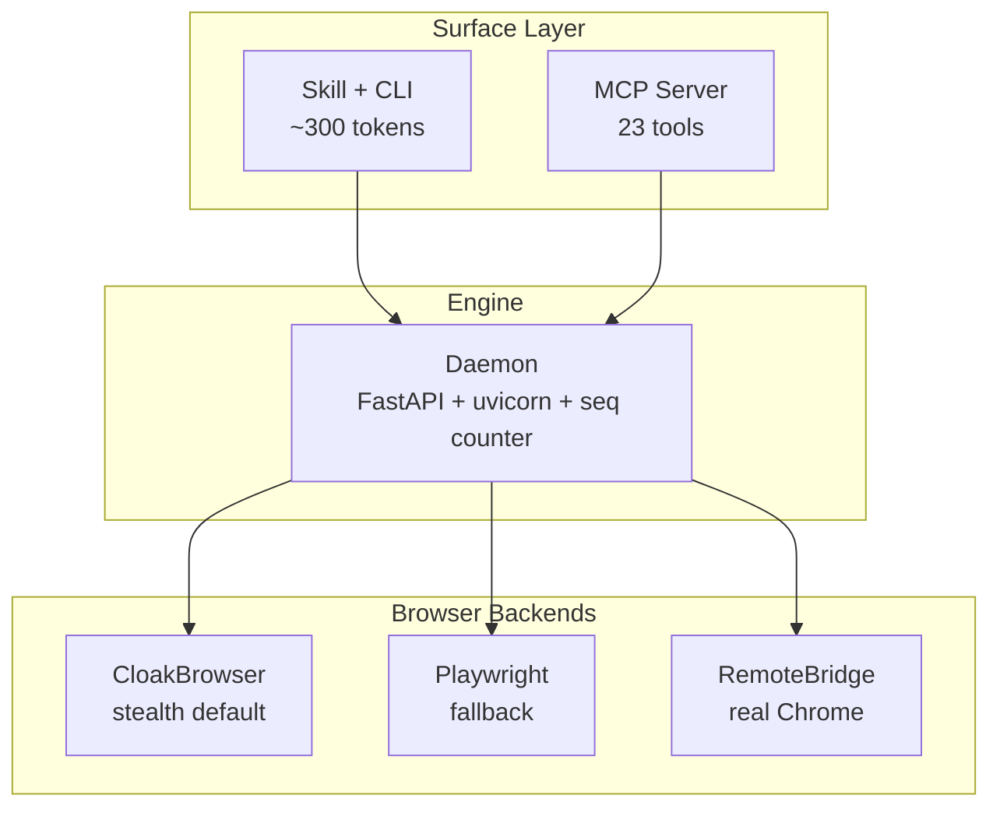

<div align="center">

# agentcloak

Agent-native stealth browser -- see, interact, and automate the web.

You need a browser. Your agents do too.

[](https://pypi.org/project/agentcloak/)
[](https://pypi.org/project/agentcloak/)
[](https://github.com/shayuc137/agentcloak/blob/main/LICENSE)
[](https://github.com/shayuc137/agentcloak/actions)

<!-- README-I18N:START -->
**English** | [中文](./README.zh.md)
<!-- README-I18N:END -->

</div>

## Highlights

- **Pages as structured text** -- every page becomes an accessibility tree with `[N]` indexed elements; agents interact by index, not fragile CSS selectors
- **CLI + Skill on-demand loading** -- agents call `cloak` via Bash; the Skill lazy-loads at ~300 tokens (vs ~6,000 for MCP tool definitions)
- **CloakBrowser built-in stealth** -- 57 C++ patches on Chromium, Cloudflare bypass out of the box
- **Session reuse** -- save/restore login profiles + RemoteBridge to operate your real Chrome browser
- **Daemon architecture** -- auto-starts on first command, manages browser lifecycle with a monotonic seq counter
- **Spells + API capture** -- wrap common site operations as one-liners; capture traffic, analyze patterns, generate spells automatically
- **MCP server with 23 tools** -- full compatibility with MCP-native clients (Claude Code, Codex, Cursor, etc.)

## Installation

**Requires Python 3.12+**

> [!TIP]
> **Agent-assisted install** -- copy this to your AI coding agent:
>
> ```text
> Install and configure agentcloak following this guide:
> https://github.com/shayuc137/agentcloak/blob/main/docs/en/getting-started/installation.md
> ```

<details>
<summary>Manual installation</summary>

```bash
pip install agentcloak
```

Everything is included: CLI (`agentcloak` and `cloak` shorthand), MCP server (`agentcloak-mcp`), CloakBrowser stealth backend, and httpcloak TLS fingerprint proxy. The patched Chromium binary (~200 MB) downloads automatically on first use to `~/.cloakbrowser/`.

**System dependencies (headless Linux only):**

CloakBrowser runs in headed mode for anti-detection. On a server without a display, agentcloak auto-starts Xvfb:

```bash
sudo apt-get install -y xvfb
```

Desktop Linux, macOS, and Windows need no extra dependencies.

</details>

## Quick Start

The daemon starts automatically on the first command.

```bash
# Navigate and get the page snapshot in one call
cloak navigate "https://example.com" --snapshot

# Output includes an accessibility tree with [N] element refs:
#   [1] link "About" href="https://example.com/about"
#   [2] button "Settings"
#   [3] combobox "Search" value="" focused

# Interact using [N] refs -- add --include-snapshot to get a fresh snapshot back
cloak fill --target 3 --text "search query" --include-snapshot
cloak press --key Enter --target 3

# Take a screenshot
cloak screenshot --output page.png
```

Every command returns one JSON object on stdout. Errors include a recovery hint:

```json
{"ok": true, "seq": 3, "data": {"url": "https://example.com", "title": "Example"}}
{"ok": false, "error": "element_not_found", "hint": "No element at index 99", "action": "re-snapshot to get fresh [N] refs"}
```

The `--snapshot` flag on `navigate` and action commands keeps the observe-act loop tight -- no separate snapshot call needed between steps.

See the full [Quick Start tutorial](docs/en/getting-started/quickstart.md) for login persistence, profile management, and API capture.

## Usage Modes

| | Skill + CLI (recommended) | MCP Server |
|---|---|---|
| **How it works** | Skill auto-loads when browser is needed; agent calls `cloak` via Bash | `agentcloak-mcp` exposes 23 tools over stdio |
| **Context cost** | ~300 tokens (on-demand) | ~6,000 tokens (persistent) |
| **Best for** | Claude Code, any Bash-capable agent | MCP-native clients without Bash |

**Skill + CLI** -- install the Skill into your project:

```bash
mkdir -p .claude/skills/agentcloak
curl -o .claude/skills/agentcloak/SKILL.md \
  https://raw.githubusercontent.com/shayuc137/agentcloak/main/.claude/skills/agentcloak/SKILL.md
```

**MCP Server** -- one-command setup for Claude Code:

```bash
claude mcp add agentcloak -- agentcloak-mcp
```

<details>
<summary>Other MCP clients (Codex, Cursor, uvx)</summary>

Add to `.codex/mcp.json` or `.cursor/mcp.json`:

```json
{
  "mcpServers": {
    "agentcloak": {
      "command": "agentcloak-mcp"
    }
  }
}
```

Or run without installing via `uvx`:

```json
{
  "mcpServers": {
    "agentcloak": {
      "command": "uvx",
      "args": ["agentcloak[mcp]"]
    }
  }
}
```

</details>

See the full [MCP setup guide](docs/en/guides/mcp-setup.md) for details.

## Browser Backends

| Backend | Stealth | Use case |
|---------|---------|----------|
| **CloakBrowser** (default) | 57 C++ patches + Cloudflare bypass | Most sites, anti-bot protected pages |
| **Playwright** | Standard Chromium | Development, testing, no stealth needed |
| **RemoteBridge** | Real browser fingerprint | Operate your own Chrome on another machine |

See the [backends guide](docs/en/guides/backends.md) for configuration details and trade-offs.

## Architecture



All backends extend a unified `BrowserContextBase` ABC. The base owns ~900 lines of shared behaviour (action dispatch, batch, dialog, self-healing); subclasses only implement 29 atomic `_xxx_impl` operations. Layer isolation is enforced: CLI cannot import browser internals, daemon cannot import CLI, backends import neither.

See the [architecture docs](docs/en/explanation/architecture.md) for a deeper walkthrough.

## Documentation

| Topic | Link |
|-------|------|
| Installation | [docs/en/getting-started/installation.md](docs/en/getting-started/installation.md) |
| Quick Start tutorial | [docs/en/getting-started/quickstart.md](docs/en/getting-started/quickstart.md) |
| CLI reference | [docs/en/reference/cli.md](docs/en/reference/cli.md) |
| MCP tools reference | [docs/en/reference/mcp.md](docs/en/reference/mcp.md) |
| Configuration | [docs/en/reference/config.md](docs/en/reference/config.md) |
| Browser backends | [docs/en/guides/backends.md](docs/en/guides/backends.md) |
| MCP setup | [docs/en/guides/mcp-setup.md](docs/en/guides/mcp-setup.md) |
| Architecture | [docs/en/explanation/architecture.md](docs/en/explanation/architecture.md) |

## Security

For vulnerability reports, see [SECURITY.md](SECURITY.md).

## Contributing

Contributions are welcome. See [CONTRIBUTING.md](CONTRIBUTING.md) for development setup, code style, and PR guidelines.

## Acknowledgments

Built on [CloakBrowser](https://github.com/CloakHQ/CloakBrowser) (stealth Chromium) and [httpcloak](https://github.com/sardanioss/httpcloak) (TLS fingerprint proxy). Design informed by [bb-browser](https://github.com/epiral/bb-browser), [browser-use](https://github.com/browser-use/browser-use), [OpenCLI](https://github.com/jackwener/OpenCLI), [GenericAgent](https://github.com/lsdefine/GenericAgent), [pinchtab](https://github.com/pinchtab/pinchtab), [open-codex-computer-use](https://github.com/iFurySt/open-codex-computer-use), and [Scrapling](https://github.com/D4Vinci/Scrapling).

## License

[MIT](LICENSE)
