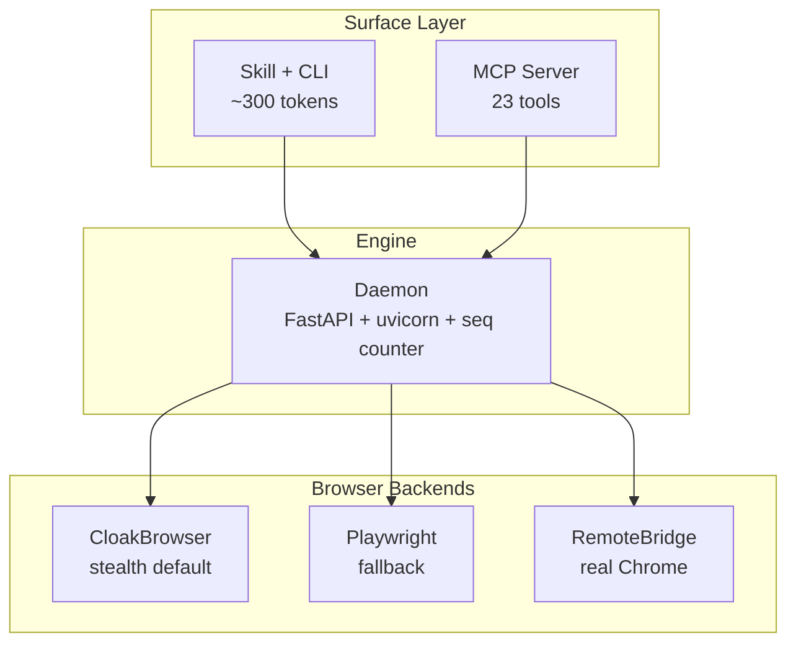

<div align="center">

# agentcloak

Agent 原生隐身浏览器 -- 看见、交互、自动化。

你需要浏览器，你的 agent 也一样。

[](https://pypi.org/project/agentcloak/)
[](https://pypi.org/project/agentcloak/)
[](https://github.com/shayuc137/agentcloak/blob/main/LICENSE)
[](https://github.com/shayuc137/agentcloak/commits/main)

<!-- README-I18N:START -->
[English](./README.md) | **中文**
<!-- README-I18N:END -->

</div>

## 亮点

- **页面即结构化文本** -- 页面转化为无障碍树，每个可交互元素带有 `[N]` 索引，agent 通过索引操作而非脆弱的 CSS 选择器
- **CLI + Skill 按需加载** -- agent 通过 Bash 调用 `cloak` 命令，Skill 按需加载仅占 ~300 tokens（MCP 工具定义常驻 ~6,000 tokens）
- **CloakBrowser 内置隐身** -- 基于 57 个 C++ 补丁的 Chromium，对抗常见指纹检测和 JS 挑战
- **登录态复用** -- 保存/恢复登录 profile，通过 RemoteBridge 操控真实 Chrome 浏览器
- **Daemon 架构** -- 首次命令自动启动，管理浏览器生命周期，单调递增的 seq 计数器追踪状态
- **Spell + API 流量捕获** -- 常见站点操作封装为一行命令；捕获流量，分析模式，自动生成 spell
- **MCP server 23 个工具** -- 完整兼容 MCP 原生客户端（Claude Code、Codex、Cursor 等）

## 安装

**需要 Python 3.12+**

> [!TIP]
> **Agent 辅助安装** -- 将下面的文本复制给你的 AI agent：
>
> ```text
> 按照此文档安装和配置 agentcloak：
> https://github.com/shayuc137/agentcloak/blob/main/docs/zh/getting-started/installation.md
> ```

<details>
<summary>手动安装</summary>

```bash
# 推荐——隔离环境，绕开 PEP 668 限制
uv tool install agentcloak     # 或：pipx install agentcloak

cloak skill install            # 将 Skill 安装包安装到你的 agent 平台
cloak doctor --fix             # 验证环境 + 下载 CloakBrowser
```

> **为什么用 `uv tool` / `pipx`？** 现代 Ubuntu/Debian 等发行版会拦截 venv 之外的 `pip install`（PEP 668 "externally-managed-environment"）。`uv tool install` 和 `pipx install` 各自为包创建独立的隔离环境，开箱即用。

如果你仍想用 `pip`，先建一个 venv：

```bash
python -m venv .venv && source .venv/bin/activate
pip install agentcloak
```

一条命令安装全部组件：CLI（`agentcloak` 和简写 `cloak`）、MCP server（`agentcloak-mcp`）、CloakBrowser 隐身后端、httpcloak TLS 指纹代理。补丁版 Chromium 二进制文件（约 200 MB）在首次使用时自动下载到 `~/.cloakbrowser/`。

**系统依赖（仅限无显示器的 Linux 服务器）：**

CloakBrowser 默认以 headless 模式运行（v0.2.0 起）——无需任何额外依赖。如果切到有头模式（`headless = false`，对抗反检测更强）且服务器没有显示器，agentcloak 会自动启动 Xvfb：

```bash
sudo apt-get install -y xvfb
```

桌面 Linux、macOS 和 Windows 无需额外依赖。

</details>

## 快速开始

daemon 在首次命令时自动启动。

```bash
# 导航并一次性获取页面 snapshot
cloak navigate "https://example.com" --snap
```

stdout 本身就是答案——文本优先，无需解析 JSON：

```text
https://example.com/ | Example Domain

# Example Domain | https://example.com/ | 8 nodes (1 interactive) | seq=1
  heading "Example Domain" level=1
  [1] link "Learn more" href="https://iana.org/domains/example"
```

```bash
# 通过 [N] 引用交互（位置参数或 --index N）-- --snap 附带返回新 snapshot
cloak fill 3 "search query" --snap
cloak press Enter

# 截图（stdout = 文件路径）
cloak screenshot
```

错误输出到 stderr，附带恢复建议和非零 exit code：

```text
Error: Element [99] not in selector_map (1 entries)
  -> run 'snapshot' to refresh the selector_map, or re-snapshot if the page changed
```

需要旧的 JSON envelope 供脚本使用？传 `--json`（或设 `AGENTCLOAK_OUTPUT=json`）：

```bash
cloak --json snapshot | jq -r '.data.tree_text'
```

`navigate` 和 action 命令的 `--snap` 参数让观察-操作循环更紧凑——无需在每步之间单独调用 snapshot。

完整教程参见[快速开始指南](docs/zh/getting-started/quickstart.md)，涵盖登录持久化、profile 管理和 API 捕获。

## 使用模式

| | Skill + CLI（推荐） | MCP Server |
|---|---|---|
| **工作方式** | Skill 在需要浏览器时自动加载，agent 通过 Bash 调用 `cloak` | `agentcloak-mcp` 通过 stdio 暴露 23 个工具 |
| **上下文开销** | ~300 tokens（按需加载） | ~6,000 tokens（常驻） |
| **适用场景** | Claude Code 及任何支持 Bash 的 agent | 没有 Bash 能力的纯 MCP 客户端 |

**Skill + CLI** -- 三条命令。`cloak skill install` 从 wheel 中提取 Skill 安装包，并将检测到的 agent 平台软链接到 `~/.agentcloak/skills/agentcloak/` 下的统一源：

```bash
# 1. 安装 agentcloak（CLI + daemon + 隐身浏览器）
uv tool install agentcloak    # 或：pipx install agentcloak（或 venv 内 pip install）

# 2. 验证环境（首次运行时下载 CloakBrowser 二进制）
cloak doctor --fix

# 3. 安装 Skill 安装包（交互式菜单选择 agent 平台）
cloak skill install
```

非交互式安装（适用于脚本）：

```bash
cloak skill install --platform claude         # ~/.claude/skills/
cloak skill install --platform codex          # ~/.codex/skills/
cloak skill install --platform all            # 全部检测到的平台
cloak skill install --path /custom/skills/dir # 任意位置
```

| Agent 平台 | Skill 位置 |
|---|---|
| Claude Code | `~/.claude/skills/agentcloak/` |
| Codex | `~/.codex/skills/agentcloak/` |
| Cursor | `.cursor/skills/agentcloak/` |
| OpenCode | `.opencode/skills/agentcloak/` |
| 其他 | 用 `--path` 指向你的 agent skills 目录 |

升级 agentcloak 后运行 `cloak skill update` 刷新安装包（软链接安装自动生效，复制安装需要重新执行）。`cloak skill uninstall` 移除安装器创建的所有链接。

详见 [Skill 安装指南](docs/zh/getting-started/installation.md#安装-skill-安装包)，包含离线 curl+tar 方式和 Windows 说明。

**MCP Server** -- Claude Code 一行配置：

```bash
claude mcp add agentcloak -- agentcloak-mcp
```

<details>
<summary>其他 MCP 客户端（Codex、Cursor、uvx）</summary>

添加到 `.codex/mcp.json` 或 `.cursor/mcp.json`：

```json
{
  "mcpServers": {
    "agentcloak": {
      "command": "agentcloak-mcp"
    }
  }
}
```

通过 `uvx` 免安装运行：

```json
{
  "mcpServers": {
    "agentcloak": {
      "command": "uvx",
      "args": ["agentcloak[mcp]"]
    }
  }
}
```

</details>

完整配置指南参见 [MCP 配置](docs/zh/guides/mcp-setup.md)。

## 浏览器后端

| 后端 | 隐身能力 | 适用场景 |
|------|---------|---------|
| **CloakBrowser**（默认） | 57 个 C++ 补丁，对抗指纹检测和 JS 挑战 | 大多数网站，反爬保护页面 |
| **Playwright** | 标准 Chromium | 开发调试，无需隐身的场景 |
| **RemoteBridge** | 真实浏览器指纹 | 操控另一台机器上的 Chrome |

详情参见[后端指南](docs/zh/guides/backends.md)。

## 架构



所有后端继承统一的 `BrowserContextBase` ABC。基类包含约 900 行共享行为（action dispatch、batch、dialog、自恢复）；子类只实现 29 个原子 `_xxx_impl` 操作。层级隔离严格执行：CLI 不能导入 browser 内部模块，daemon 不能导入 CLI，后端两者都不导入。

详情参见[架构文档](docs/zh/explanation/architecture.md)。

## 文档

| 主题 | 链接 |
|------|------|
| 安装指南 | [docs/zh/getting-started/installation.md](docs/zh/getting-started/installation.md) |
| 快速开始教程 | [docs/zh/getting-started/quickstart.md](docs/zh/getting-started/quickstart.md) |
| CLI 参考 | [docs/zh/reference/cli.md](docs/zh/reference/cli.md) |
| MCP 工具参考 | [docs/zh/reference/mcp.md](docs/zh/reference/mcp.md) |
| 配置参考 | [docs/zh/reference/config.md](docs/zh/reference/config.md) |
| 浏览器后端 | [docs/zh/guides/backends.md](docs/zh/guides/backends.md) |
| MCP 配置 | [docs/zh/guides/mcp-setup.md](docs/zh/guides/mcp-setup.md) |
| 架构 | [docs/zh/explanation/architecture.md](docs/zh/explanation/architecture.md) |

## 安全

漏洞报告方式参见 [SECURITY.md](SECURITY.md)。

## 贡献

欢迎贡献。开发环境配置、代码风格和 PR 规范参见 [CONTRIBUTING.md](CONTRIBUTING.md)。

## 致谢

基于 [CloakBrowser](https://github.com/CloakHQ/CloakBrowser)（隐身 Chromium）
和 [httpcloak](https://github.com/sardanioss/httpcloak)（TLS 指纹代理）构建。

设计参考了
[bb-browser](https://github.com/epiral/bb-browser)、
[browser-use](https://github.com/browser-use/browser-use)、
[OpenCLI](https://github.com/jackwener/OpenCLI)、
[GenericAgent](https://github.com/lsdefine/GenericAgent)、
[pinchtab](https://github.com/pinchtab/pinchtab)、
[open-codex-computer-use](https://github.com/iFurySt/open-codex-computer-use)
和 [Scrapling](https://github.com/D4Vinci/Scrapling)。

## 许可证

[MIT](LICENSE)
