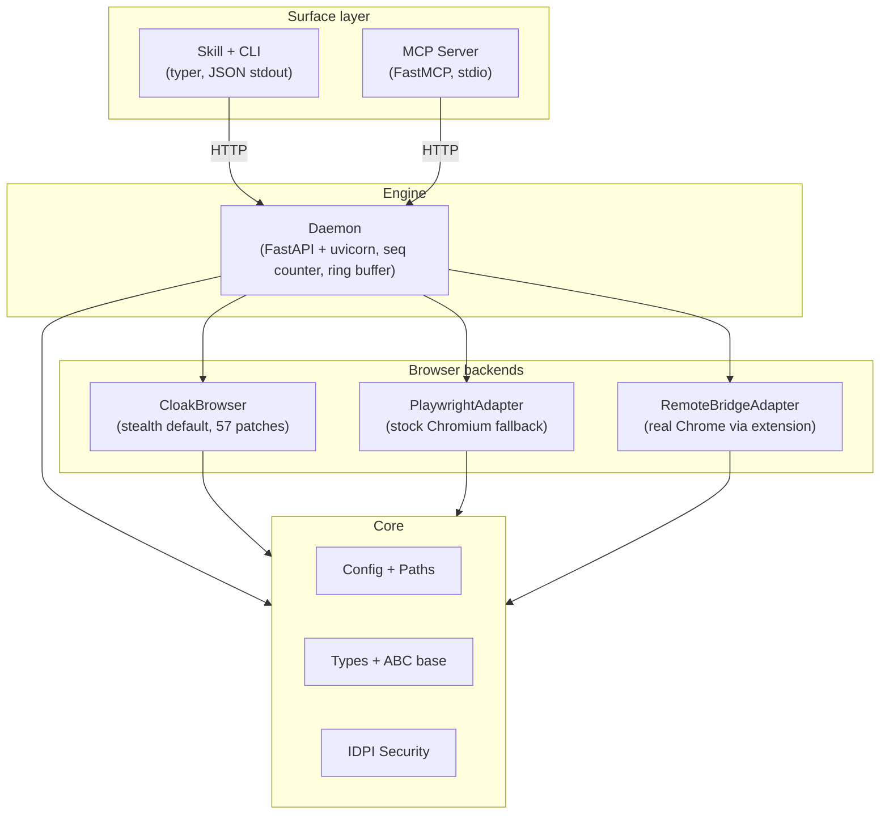

# Architecture

agentcloak uses a layered architecture where each layer has strict dependency boundaries. This design keeps the CLI thin, the daemon stateful, and the browser backends interchangeable.

## Layer diagram



## Layers

### Surface layer: CLI and MCP

The surface layer is how agents and users interact with agentcloak. Both surfaces talk to the daemon over HTTP and produce identical results.

**CLI** (`src/agentcloak/cli/`): Built with [typer](https://github.com/fastapi/typer). Every command sends an HTTP request to the daemon (via the shared `httpx`-based `DaemonClient`) and prints one JSON object to stdout. The CLI never touches browser internals.

**MCP Server** (`src/agentcloak/mcp/`): Built with [FastMCP](https://github.com/modelcontextprotocol/python-sdk). Runs as a stdio MCP server, exposing 23 tools that map to daemon HTTP endpoints. The MCP server auto-starts the daemon on the first request, sharing the same `DaemonClient` (async mode) as the CLI uses in sync mode.

Both surfaces share the same daemon backend. Adding a new capability means adding one daemon route — the CLI/MCP adapters and the Skill `commands-reference.md` are generated or verified from the OpenAPI spec the daemon publishes at `/openapi.json`.

### Engine: daemon

The daemon (`src/agentcloak/daemon/`) is a long-running FastAPI application served by uvicorn. It manages browser lifecycle and state.

**Responsibilities:**
- Browser launch, shutdown, and health monitoring
- Routing HTTP requests to the active `BrowserContextBase` instance
- Tracking state changes with a monotonic `seq` counter
- Storing recent events in a ring buffer for resume and network history
- Caching snapshots for progressive loading (focus, offset, diff)
- Managing action state feedback (pending requests, dialogs, navigation)
- Tab management across all backends

**Lifecycle:** The daemon auto-starts on the first CLI or MCP command. It runs on `127.0.0.1:18765` by default and stays alive until explicitly stopped or idle-timeout triggers. OpenAPI spec is served at `/openapi.json`; Swagger UI at `/docs`.

**Service layer**: Business logic (stale-ref retry, snapshot diff, profile CRUD, capture export, doctor checks) lives in `daemon/services/`. Route handlers are thin HTTP shells that parse the Pydantic request body, call a service method, and wrap the return value in the `OkEnvelope` shape.

### Browser backends

All backends extend the `BrowserContextBase` ABC (`src/agentcloak/browser/base.py`). The base owns ~900 lines of shared behaviour:

- `navigate / evaluate / network / screenshot` orchestration
- `action(kind, target, **kw)` dispatch (validates, raises if dialog blocked, attaches feedback fields)
- `action_batch(...)` sequential runner with dialog interrupt + `$N.path` reference resolution
- `wait / upload / dialog_handle / frame / tab` shared logic
- Browser self-healing (raise structured `browser_closed` error on next call instead of leaking raw Playwright exceptions)
- seq counter + ring buffer + snapshot cache + capture store

Subclasses only implement 29 atomic `_xxx_impl` operations (one per action kind, one per snapshot mode primitive, one for tab/frame ops, etc.):

```python
class BrowserContextBase(ABC):
    @abstractmethod
    async def _navigate_impl(self, url: str, *, timeout: float) -> dict[str, Any]: ...
    @abstractmethod
    async def _click_impl(self, *, target, x, y, button, click_count) -> dict[str, Any]: ...
    @abstractmethod
    async def _screenshot_impl(self, *, full_page, fmt, quality) -> bytes: ...
    # ... 26 more
```

The daemon interacts only with the base class. Backend selection happens at launch time and is transparent to everything above.

**CloakBrowser** (`cloak_ctx.py`, default): Wraps CloakBrowser's patched Chromium with Xvfb auto-management and optional humanize support.

**PlaywrightAdapter** (`playwright_ctx.py`): Standard Playwright Chromium. Fallback for environments where CloakBrowser is not available.

**RemoteBridgeAdapter** (`bridge_ctx.py`): Connects to a real Chrome browser via the bridge extension and WebSocket. Atomic methods are implemented over raw CDP commands sent through the extension.

### Core

The core layer (`src/agentcloak/core/`) contains shared types, configuration, and security:

- **Config**: TOML loading, environment variable resolution, path management. Distributed to routes via FastAPI `Depends(get_config)` so magic numbers (timeouts, ports, quality) live in one place
- **Types**: `StealthTier` enum, `PageSnapshot` dataclass, structured error classes (`AgentBrowserError` hierarchy) used by the FastAPI exception handler
- **Security**: IDPI domain whitelist/blacklist, content scanning, untrusted content wrapping

### Shared client

`src/agentcloak/client/daemon_client.py` is the single HTTP client both CLI and MCP use. Built on `httpx`, it exposes sync + async method pairs (`navigate_sync` / `navigate`) so CLI commands stay sync and MCP tools stay async without duplicating wiring. Auto-start and the structured exception classification (five distinct `error` codes for httpx transport failures) live here.

### Spells

Spells (`src/agentcloak/spells/`) are reusable automation commands for specific sites. They use a `@spell` decorator and can be written as pipeline DSL (declarative) or async functions.

Spells depend on core and the browser protocol but not on the daemon or CLI directly.

## Layer isolation

Dependencies are strictly one-way:

| Layer | Can import | Cannot import |
|-------|-----------|---------------|
| CLI | `agentcloak.client`, daemon HTTP API | browser, daemon internals |
| MCP | `agentcloak.client`, daemon HTTP API | browser, daemon internals |
| Daemon | browser, core | CLI, MCP |
| Browser | core | CLI, daemon |
| Spells | core, browser ABC | CLI, daemon |
| Core | stdlib, third-party | any sibling layer |

This is enforced by the project structure. The CI checks import boundaries.

## Request flow

A typical CLI command flows through the system like this:

```
User/Agent
  |
  v
CLI (typer)
  | DaemonClient (httpx, sync)
  v
HTTP POST /navigate {"url": "https://example.com"}
  v
Daemon (FastAPI + uvicorn)
  | route handler validates NavigateRequest (Pydantic)
  | calls service or BrowserContextBase.navigate(url)
  | seq += 1
  v
BrowserContextBase
  | dispatches to _navigate_impl on the active subclass
  v
PlaywrightAdapter / CloakAdapter / RemoteBridgeAdapter
  | Playwright page.goto(url) or CDP Page.navigate
  v
Chromium / Chrome
  |
  v
Response flows back: Browser -> Daemon -> CLI -> stdout JSON
```

The MCP flow is identical except the entry point is an MCP tool call instead of a CLI command.

## State management

The daemon tracks browser state through several mechanisms:

**Seq counter**: A monotonic integer that increments on every state-changing action. Clients can compare seq values to detect stale state.

**Ring buffer**: Stores recent network requests and console messages. Supports `--since last_action` filtering.

**Snapshot cache**: The daemon caches the most recent full snapshot. Progressive loading features (focus, offset, diff) operate on this cache without re-querying the browser.

**Resume file**: Persists current URL, open tabs, recent actions, and capture state. Used to restore context after daemon restart.

## Port allocation

The daemon and bridge share the port range 18765-18774:

| Port | Purpose |
|------|---------|
| 18765 | Daemon default (HTTP API) |
| 18766-18774 | Available for bridge connections |

Override with `AGENTCLOAK_PORT` or `daemon.port` in config.
