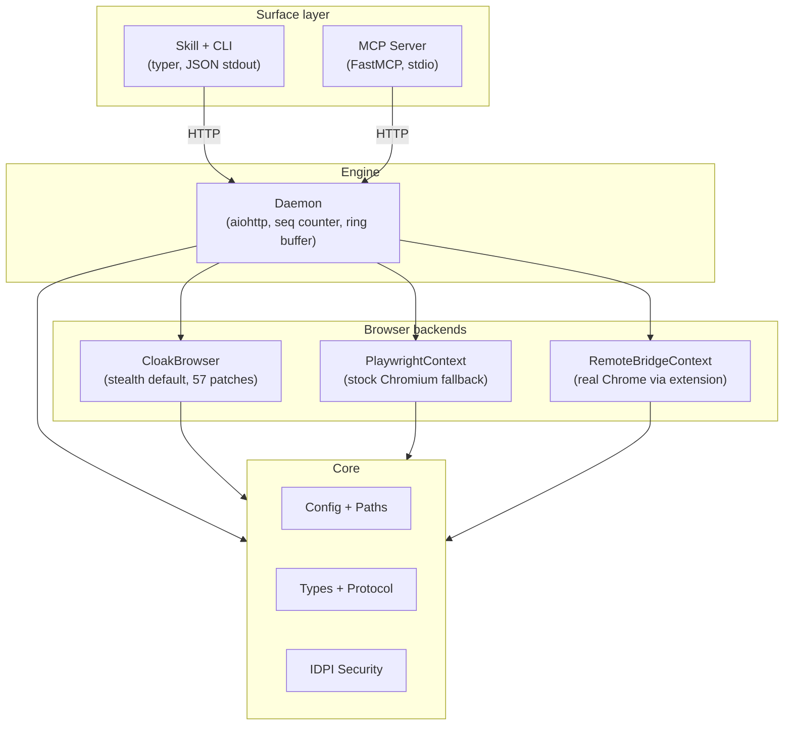

# Architecture

agentcloak uses a layered architecture where each layer has strict dependency boundaries. This design keeps the CLI thin, the daemon stateful, and the browser backends interchangeable.

## Layer diagram



## Layers

### Surface layer: CLI and MCP

The surface layer is how agents and users interact with agentcloak. Both surfaces talk to the daemon over HTTP and produce identical results.

**CLI** (`src/agentcloak/cli/`): Built with [typer](https://github.com/fastapi/typer). Every command sends an HTTP request to the daemon and prints one JSON object to stdout. The CLI never touches browser internals.

**MCP Server** (`src/agentcloak/mcp/`): Built with [FastMCP](https://github.com/modelcontextprotocol/python-sdk). Runs as a stdio MCP server, exposing 23 tools that map to daemon HTTP endpoints. The MCP server auto-starts the daemon on the first request.

Both surfaces share the same daemon backend. Adding a new capability means adding one daemon route, one CLI command, and one MCP tool.

### Engine: daemon

The daemon (`src/agentcloak/daemon/`) is a long-running aiohttp process that manages browser lifecycle and state.

**Responsibilities:**
- Browser launch, shutdown, and health monitoring
- Routing HTTP requests to the active `BrowserContext`
- Tracking state changes with a monotonic `seq` counter
- Storing recent events in a ring buffer for resume and network history
- Caching snapshots for progressive loading (focus, offset, diff)
- Managing action state feedback (pending requests, dialogs, navigation)
- Tab management across all backends

**Lifecycle:** The daemon auto-starts on the first CLI or MCP command. It runs on `127.0.0.1:18765` by default and stays alive until explicitly stopped or idle-timeout triggers.

### Browser backends

All backends implement the `BrowserContext` protocol -- a contract of 6 async methods + 2 properties:

```python
class BrowserContext(Protocol):
    async def navigate(self, url: str, *, timeout: float = 30.0) -> dict
    async def snapshot(self, *, mode: str = "accessible") -> PageSnapshot
    async def screenshot(self, *, full_page: bool = False) -> bytes
    async def action(self, kind: str, target: str, **kwargs) -> dict
    async def evaluate(self, js: str) -> Any
    async def close(self) -> None

    @property
    def seq(self) -> int: ...
    @property
    def page(self) -> Page: ...
```

The daemon interacts only with this protocol. Backend selection happens at launch time and is transparent to everything above.

**CloakBrowser** (`cloak_ctx.py`): Default backend. Wraps CloakBrowser's patched Chromium with Xvfb auto-management and humanize support.

**PlaywrightContext** (`playwright_ctx.py`): Standard Playwright Chromium. Fallback for environments where CloakBrowser is not available.

**RemoteBridgeContext** (`bridge_ctx.py`): Connects to a real Chrome browser via the bridge extension and WebSocket. Commands are routed through the extension's Chrome DevTools Protocol bridge.

### Core

The core layer (`src/agentcloak/core/`) contains shared types, configuration, and security:

- **Config**: TOML loading, environment variable resolution, path management
- **Types**: `StealthTier` enum, `PageSnapshot` dataclass, error envelope format
- **Security**: IDPI domain whitelist/blacklist, content scanning, untrusted content wrapping

### Spells

Spells (`src/agentcloak/spells/`) are reusable automation commands for specific sites. They use a `@spell` decorator and can be written as pipeline DSL (declarative) or async functions.

Spells depend on core and the browser protocol but not on the daemon or CLI directly.

## Layer isolation

Dependencies are strictly one-way:

| Layer | Can import | Cannot import |
|-------|-----------|---------------|
| CLI | daemon HTTP API | browser, daemon internals |
| MCP | daemon HTTP API | browser, daemon internals |
| Daemon | browser, core | CLI, MCP |
| Browser | core | CLI, daemon |
| Spells | core, browser protocol | CLI, daemon |
| Core | stdlib, third-party | any sibling layer |

This is enforced by the project structure. The CI checks import boundaries.

## Request flow

A typical CLI command flows through the system like this:

```
User/Agent
  |
  v
CLI (typer)
  | HTTP POST /navigate {"url": "https://example.com"}
  v
Daemon (aiohttp)
  | ctx = active BrowserContext
  | result = await ctx.navigate(url)
  | seq += 1
  v
BrowserContext (CloakBrowser/Playwright/Bridge)
  | Playwright page.goto(url)
  v
Chromium / Chrome
  |
  v
Response flows back: Browser -> Daemon -> CLI -> stdout JSON
```

The MCP flow is identical except the entry point is an MCP tool call instead of a CLI command.

## State management

The daemon tracks browser state through several mechanisms:

**Seq counter**: A monotonic integer that increments on every state-changing action. Clients can compare seq values to detect stale state.

**Ring buffer**: Stores recent network requests and console messages. Supports `--since last_action` filtering.

**Snapshot cache**: The daemon caches the most recent full snapshot. Progressive loading features (focus, offset, diff) operate on this cache without re-querying the browser.

**Resume file**: Persists current URL, open tabs, recent actions, and capture state. Used to restore context after daemon restart.

## Port allocation

The daemon and bridge share the port range 18765-18774:

| Port | Purpose |
|------|---------|
| 18765 | Daemon default (HTTP API) |
| 18766-18774 | Available for bridge connections |

Override with `AGENTCLOAK_PORT` or `daemon.port` in config.
