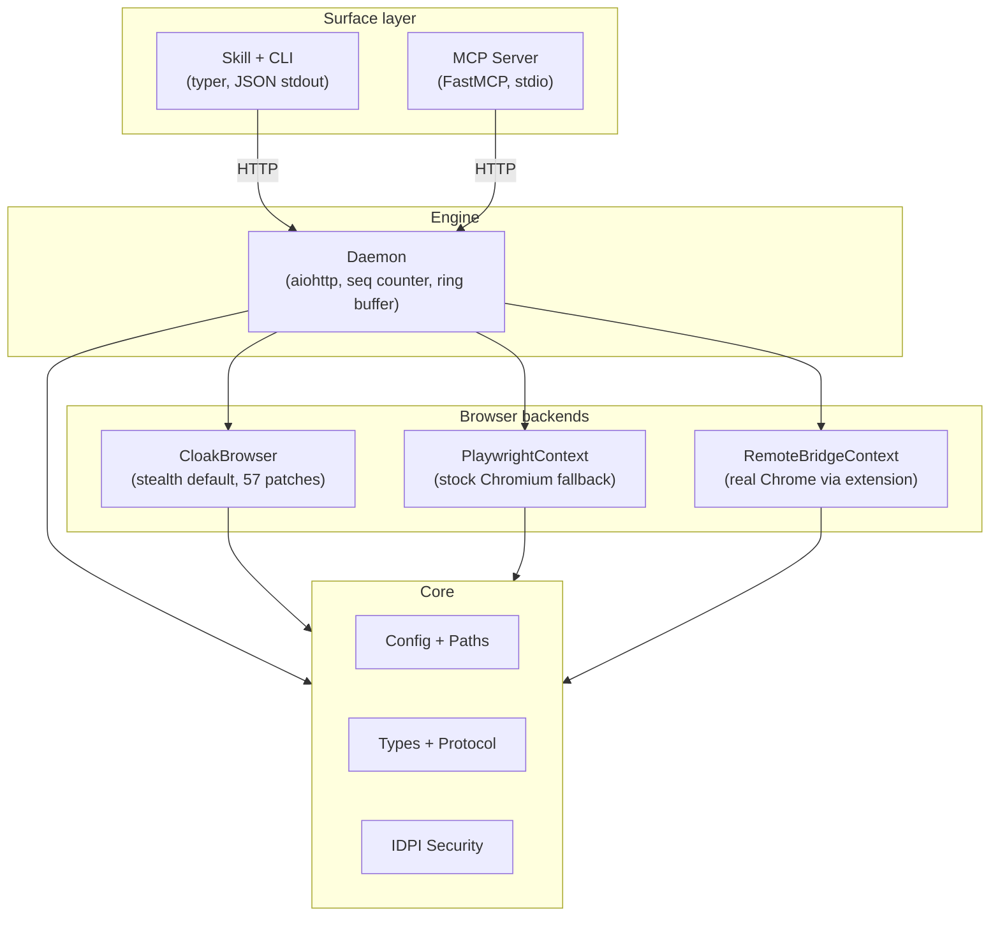

# 架构

agentcloak 采用分层架构，每一层有严格的依赖边界。这种设计保持了 CLI 的轻量、daemon 的有状态性、以及浏览器后端的可互换性。

## 层级图



## 各层详解

### 表面层：CLI 和 MCP

表面层是 agent 和用户与 agentcloak 交互的接口。两种表面都通过 HTTP 与 daemon 通信，产生相同的结果。

**CLI**（`src/agentcloak/cli/`）：基于 [typer](https://github.com/fastapi/typer) 构建。每个命令向 daemon 发送 HTTP 请求，并在 stdout 输出一个 JSON 对象。CLI 不接触 browser 内部实现。

**MCP Server**（`src/agentcloak/mcp/`）：基于 [FastMCP](https://github.com/modelcontextprotocol/python-sdk) 构建。作为 stdio MCP server 运行，暴露 23 个映射到 daemon HTTP 端点的工具。MCP server 在首次请求时自动启动 daemon。

两种表面共享同一个 daemon 后端。新增一项能力意味着添加一个 daemon 路由、一个 CLI 命令和一个 MCP 工具。

### 引擎层：daemon

daemon（`src/agentcloak/daemon/`）是一个长期运行的 aiohttp 进程，管理浏览器生命周期和状态。

**职责：**
- 浏览器启动、关闭和健康监控
- 将 HTTP 请求路由到活跃的 `BrowserContext`
- 通过单调递增的 `seq` 计数器追踪状态变化
- 在环形缓冲区中存储最近事件，用于恢复和网络历史
- 缓存 snapshot 以支持渐进加载（focus、offset、diff）
- 管理 action 状态反馈（待处理请求、对话框、导航）
- 跨后端的标签页管理

**生命周期：** daemon 在首次 CLI 或 MCP 命令时自动启动。默认运行在 `127.0.0.1:18765`，持续运行直到被显式停止或空闲超时触发。

### 浏览器后端

所有后端实现 `BrowserContext` 协议 -- 一个包含 6 个异步方法和 2 个属性的契约：

```python
class BrowserContext(Protocol):
    async def navigate(self, url: str, *, timeout: float = 30.0) -> dict
    async def snapshot(self, *, mode: str = "accessible") -> PageSnapshot
    async def screenshot(self, *, full_page: bool = False) -> bytes
    async def action(self, kind: str, target: str, **kwargs) -> dict
    async def evaluate(self, js: str) -> Any
    async def close(self) -> None

    @property
    def seq(self) -> int: ...
    @property
    def page(self) -> Page: ...
```

daemon 只与此协议交互。后端选择在启动时确定，对上层完全透明。

**CloakBrowser**（`cloak_ctx.py`）：默认后端。封装 CloakBrowser 的补丁版 Chromium，支持 Xvfb 自动管理和拟人行为。

**PlaywrightContext**（`playwright_ctx.py`）：标准 Playwright Chromium。当 CloakBrowser 不可用时的后备方案。

**RemoteBridgeContext**（`bridge_ctx.py`）：通过 bridge 扩展和 WebSocket 连接到真实 Chrome 浏览器。命令通过扩展的 Chrome DevTools Protocol bridge 路由。

### 核心层

核心层（`src/agentcloak/core/`）包含共享类型、配置和安全机制：

- **Config**：TOML 加载、环境变量解析、路径管理
- **Types**：`StealthTier` 枚举、`PageSnapshot` 数据类、错误信封格式
- **Security**：IDPI 域名白名单/黑名单、内容扫描、不可信内容包裹

### Spell

Spell（`src/agentcloak/spells/`）是针对特定站点的可复用自动化命令。使用 `@spell` 装饰器编写，支持管道 DSL（声明式）或异步函数两种模式。

Spell 依赖 core 和 browser 协议，不直接依赖 daemon 或 CLI。

## 层级隔离

依赖关系严格单向：

| 层 | 可导入 | 不可导入 |
|----|-------|---------|
| CLI | daemon HTTP API | browser、daemon 内部模块 |
| MCP | daemon HTTP API | browser、daemon 内部模块 |
| Daemon | browser、core | CLI、MCP |
| Browser | core | CLI、daemon |
| Spells | core、browser 协议 | CLI、daemon |
| Core | 标准库、第三方库 | 任何同级层 |

这由项目结构保证。CI 检查导入边界。

## 请求流程

一个典型的 CLI 命令在系统中的流转过程：

```
User/Agent
  |
  v
CLI (typer)
  | HTTP POST /navigate {"url": "https://example.com"}
  v
Daemon (aiohttp)
  | ctx = active BrowserContext
  | result = await ctx.navigate(url)
  | seq += 1
  v
BrowserContext (CloakBrowser/Playwright/Bridge)
  | Playwright page.goto(url)
  v
Chromium / Chrome
  |
  v
Response flows back: Browser -> Daemon -> CLI -> stdout JSON
```

MCP 的流程完全相同，只是入口点从 CLI 命令变为 MCP 工具调用。

## 状态管理

daemon 通过多种机制追踪浏览器状态：

**Seq 计数器**：每次状态变更操作时递增的单调整数。客户端可以比较 seq 值来检测过期状态。

**环形缓冲区**：存储最近的网络请求和控制台消息。支持 `--since last_action` 过滤。

**Snapshot 缓存**：daemon 缓存最近一次完整 snapshot。渐进加载功能（focus、offset、diff）基于此缓存操作，无需重新查询浏览器。

**恢复文件**：持久化当前 URL、打开的标签页、最近操作和捕获状态。用于 daemon 重启后恢复上下文。

## 端口分配

daemon 和 bridge 共享端口范围 18765-18774：

| 端口 | 用途 |
|------|------|
| 18765 | Daemon 默认（HTTP API） |
| 18766-18774 | Bridge 连接可用端口 |

通过 `AGENTCLOAK_PORT` 或配置文件中的 `daemon.port` 覆盖。
