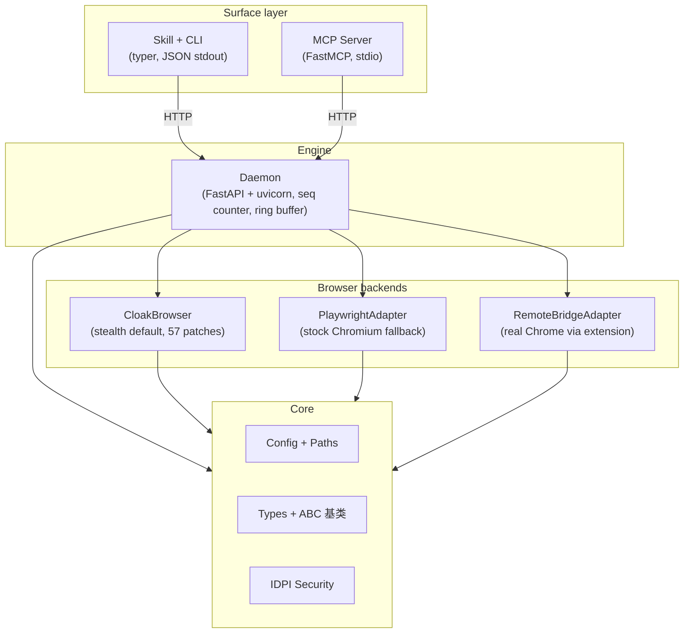

# 架构

agentcloak 采用分层架构，每一层有严格的依赖边界。这种设计保持了 CLI 的轻量、daemon 的有状态性、以及浏览器后端的可互换性。

## 层级图



## 各层详解

### 表面层：CLI 和 MCP

表面层是 agent 和用户与 agentcloak 交互的接口。两种表面都通过 HTTP 与 daemon 通信，产生相同的结果。

**CLI**（`src/agentcloak/cli/`）：基于 [typer](https://github.com/fastapi/typer) 构建。每个命令通过共享的 `httpx` 客户端 `DaemonClient` 向 daemon 发送 HTTP 请求，并在 stdout 输出一个 JSON 对象。CLI 不接触 browser 内部实现。

**MCP Server**（`src/agentcloak/mcp/`）：基于 [FastMCP](https://github.com/modelcontextprotocol/python-sdk) 构建。作为 stdio MCP server 运行，暴露 23 个映射到 daemon HTTP 端点的工具。MCP server 在首次请求时自动启动 daemon，复用同一个 `DaemonClient`（异步模式，CLI 是同步模式）。

两种表面共享同一个 daemon 后端。新增一项能力只需添加一个 daemon 路由 —— CLI/MCP 适配层和 Skill 的 `commands-reference.md` 都从 daemon 在 `/openapi.json` 暴露的 OpenAPI 规范自动生成或校验。

### 引擎层：daemon

daemon（`src/agentcloak/daemon/`）是一个由 uvicorn 服务的 FastAPI 应用，长期运行，管理浏览器生命周期和状态。

**职责：**
- 浏览器启动、关闭和健康监控
- 将 HTTP 请求路由到活跃的 `BrowserContext`
- 通过单调递增的 `seq` 计数器追踪状态变化
- 在环形缓冲区中存储最近事件，用于恢复和网络历史
- 缓存 snapshot 以支持渐进加载（focus、offset、diff）
- 管理 action 状态反馈（待处理请求、对话框、导航）
- 跨后端的标签页管理

**生命周期：** daemon 在首次 CLI 或 MCP 命令时自动启动。默认运行在 `127.0.0.1:18765`，持续运行直到被显式停止或空闲超时触发。OpenAPI 规范暴露在 `/openapi.json`，Swagger UI 在 `/docs`。

**Service 层**：业务逻辑（stale-ref 重试、snapshot diff、profile CRUD、capture 导出、doctor 检查）住在 `daemon/services/`。Route handler 退化为薄壳，只做三件事：解析 Pydantic 请求体、调 service 方法、把返回值包成 `OkEnvelope`。

### 浏览器后端

所有后端继承 `BrowserContextBase` ABC 抽象基类（`src/agentcloak/browser/base.py`）。基类拥有约 900 行共享行为：

- `navigate / evaluate / network / screenshot` 编排
- `action(kind, target, **kw)` 分发（校验、对话框拦截、附加 feedback 字段）
- `action_batch(...)` 顺序运行器（dialog 中断、`$N.path` 引用解析）
- `wait / upload / dialog_handle / frame / tab` 共享逻辑
- 浏览器自恢复（下次请求拿结构化 `browser_closed` 错误，不再泄露原始 Playwright 异常）
- seq 计数器 + 环形缓冲区 + snapshot 缓存 + capture store

子类只需实现 29 个原子操作 `_xxx_impl`（每种 action kind 一个、每种 snapshot 模式底层原语一个、tab/frame 操作各一个等）：

```python
class BrowserContextBase(ABC):
    @abstractmethod
    async def _navigate_impl(self, url: str, *, timeout: float) -> dict[str, Any]: ...
    @abstractmethod
    async def _click_impl(self, *, target, x, y, button, click_count) -> dict[str, Any]: ...
    @abstractmethod
    async def _screenshot_impl(self, *, full_page, fmt, quality) -> bytes: ...
    # ... 还有 26 个
```

daemon 只与基类交互。后端选择在启动时确定，对上层完全透明。

**CloakBrowser**（`cloak_ctx.py`，默认）：封装 CloakBrowser 的补丁版 Chromium，支持 Xvfb 自动管理和可选的拟人行为。

**PlaywrightAdapter**（`playwright_ctx.py`）：标准 Playwright Chromium。当 CloakBrowser 不可用时的后备方案。

**RemoteBridgeAdapter**（`bridge_ctx.py`）：通过 bridge 扩展和 WebSocket 连接到真实 Chrome 浏览器。原子方法基于扩展传送的原始 CDP 命令实现。

### 核心层

核心层（`src/agentcloak/core/`）包含共享类型、配置和安全机制：

- **Config**：TOML 加载、环境变量解析、路径管理。通过 FastAPI `Depends(get_config)` 注入到各个 route，所有 magic number（超时、端口、quality）都从一处流转
- **Types**：`StealthTier` 枚举、`PageSnapshot` 数据类、结构化错误类（`AgentBrowserError` 体系）—— 由 FastAPI exception handler 统一翻译成三字段信封响应
- **Security**：IDPI 域名白名单/黑名单、内容扫描、不可信内容包裹

### 共享客户端层

`src/agentcloak/client/daemon_client.py` 是 CLI 和 MCP 共用的唯一 HTTP 客户端。基于 `httpx` 构建，暴露 sync + async 方法对（`navigate_sync` / `navigate`）—— CLI 命令保持同步、MCP 工具保持异步，不需要重复布线。auto-start 逻辑和五种 httpx 传输异常的结构化分类（五种不同的 `error` code）都住在这里。

### Spell

Spell（`src/agentcloak/spells/`）是针对特定站点的可复用自动化命令。使用 `@spell` 装饰器编写，支持管道 DSL（声明式）或异步函数两种模式。

Spell 依赖 core 和 browser 协议，不直接依赖 daemon 或 CLI。

## 层级隔离

依赖关系严格单向：

| 层 | 可导入 | 不可导入 |
|----|-------|---------|
| CLI | `agentcloak.client`、daemon HTTP API | browser、daemon 内部模块 |
| MCP | `agentcloak.client`、daemon HTTP API | browser、daemon 内部模块 |
| Daemon | browser、core | CLI、MCP |
| Browser | core | CLI、daemon |
| Spells | core、browser ABC | CLI、daemon |
| Core | 标准库、第三方库 | 任何同级层 |

这由项目结构保证。CI 检查导入边界。

## 请求流程

一个典型的 CLI 命令在系统中的流转过程：

```
User/Agent
  |
  v
CLI (typer)
  | DaemonClient (httpx, sync)
  v
HTTP POST /navigate {"url": "https://example.com"}
  v
Daemon (FastAPI + uvicorn)
  | route handler 校验 NavigateRequest (Pydantic)
  | 调 service 或 BrowserContextBase.navigate(url)
  | seq += 1
  v
BrowserContextBase
  | 分发到活跃子类的 _navigate_impl
  v
PlaywrightAdapter / CloakAdapter / RemoteBridgeAdapter
  | Playwright page.goto(url) 或 CDP Page.navigate
  v
Chromium / Chrome
  |
  v
Response flows back: Browser -> Daemon -> CLI -> stdout JSON
```

MCP 的流程完全相同，只是入口点从 CLI 命令变为 MCP 工具调用。

## 状态管理

daemon 通过多种机制追踪浏览器状态：

**Seq 计数器**：每次状态变更操作时递增的单调整数。客户端可以比较 seq 值来检测过期状态。

**环形缓冲区**：存储最近的网络请求和控制台消息。支持 `--since last_action` 过滤。

**Snapshot 缓存**：daemon 缓存最近一次完整 snapshot。渐进加载功能（focus、offset、diff）基于此缓存操作，无需重新查询浏览器。

**恢复文件**：持久化当前 URL、打开的标签页、最近操作和捕获状态。用于 daemon 重启后恢复上下文。

## 端口分配

daemon 和 bridge 共享端口范围 18765-18774：

| 端口 | 用途 |
|------|------|
| 18765 | Daemon 默认（HTTP API） |
| 18766-18774 | Bridge 连接可用端口 |

通过 `AGENTCLOAK_PORT` 或配置文件中的 `daemon.port` 覆盖。
